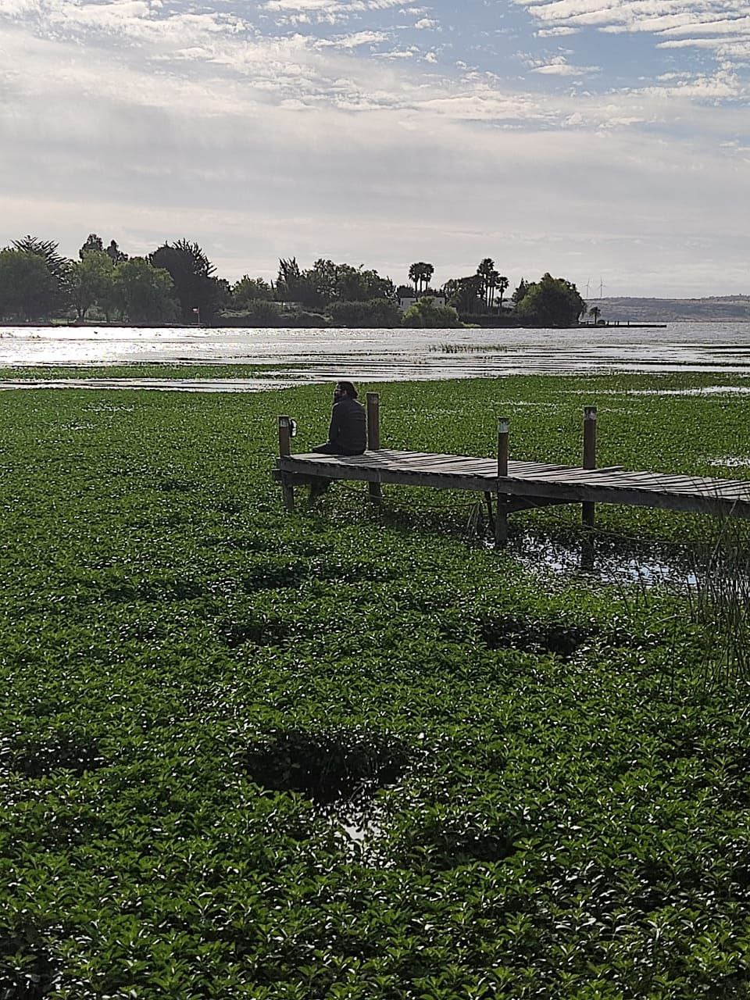

Hi there!

My name is Endherson and this is my first ever personal blog. I'm a software engineer with over
9 years of experience focus on .NET and Android development. I've decided to create this site
to share insights on topics I find interesting and maybe as a way to remind myself how to do
certain things. So, my posts will likely revolve around technologies and tools used in mobile
and app architecture.

Besides tech, I'm an avid reader who enjoys exploring several genres as a way to relax, learn
and hopefully understand different cultures. You'll find a section dedicated to book reviews,
where I share my thoughts on what I have read. While I might review famous titles, I'll focus
on lesser-known books and those I believe deserve some more attention, since they lack of the
exposure, analysis and discussion compared with popular ones—after all, you can always find
specialized studies and reviews about the famous ones. I also like traveling and in the recent
years, I've tried to get a significant trip, at least, once per year and hope to share my experience
about this as well.

Feel free to reach me out to share ideas or suggest topics—I'd love to connect and hear from you!

Regards,\
Endherson
