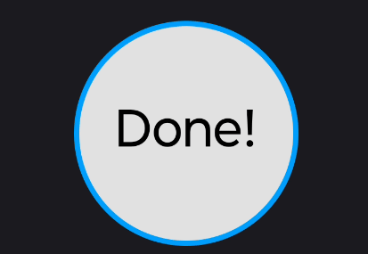

In this article, we'll walk through how to create a circular progress view from scratch without relaying on any third party libraries.
<!--more-->

The final result will look like the next image:



So, where do we start?

If we think about the image, we can break it down into three main components: the solid gray background, the blue circular border that adjusts its angle based on the progress and the text in the center displaying the current percentage. Since this is a custom view, the next step is to decide the base view. We don't need any particular behavior before hand, therefore, the election for our needs is the [View](https://developer.android.com/reference/android/view/View) class:




**Remember!** The @JvmOverloads constructor can be detrimental in certain custom views.


Now that we've chosen the view, we can use the [Paint](https://developer.android.com/reference/android/graphics/Paint) class from Android graphics library to create the main three components:



We need to find a way to tell the system how to use our paints. And the way of doing it, it's by overriding the [onDraw](https://developer.android.com/develop/ui/views/layout/custom-views/custom-drawing) method. As per documentation, we can use the [canvas](https://developer.android.com/reference/android/graphics/Canvas) object to draw the view itself. But how do we achieve this? well, fortunately, Android APIs are very powerful for these cases and all what it takes it's a little bit of math and the right methods. If we step back for a moment, we remember that our objective is to draw a circular view, therefore we are gonna use the drawCircle provided by the canvas. To do so, we need to specify the Cartesian coordinates for the center of the circle, its radius and the paint that will render the view:



As you can notice, we ensure of selecting the largest radius between the width and the height of the view, and we calculate the coordinates of the view vertically and horizontally, where the center of the circle will be drawn. We also consider into account the border size of the view (the arc we'll draw next) before passing the plaint object. At this stage, if we add the PercentageCircleView to the layout, we can see a circle being rended. So far, so good!

Next step is to draw the border. To achieve this, we'll use drawArc method from the canvas and apply some basic math to calculate the angle of the arc according to the current percentage:
```kotlin
val sweepAngle = (360 * animatedPercentage) / 100f
```
By multiplying animatedPercentage by 360 and dividing by 100, we convert the percentage into an angle in degrees inside the bounds from 0° to 360°. We also need to specify the starting angle for the arc. Knowing that setting the angle to 0° will start it in the right side of the circle, then we use -90° to start on the top of the circle. Finally we pass our borderPlaint object.



At this point, the text inside the circle left to be drawn. Following the same logic as before, we select the right API to draw the text, which is drawText. This API is simpler than the others; it only requires the coordinates that we have calculated previously and the plaint object to be passed. Additionally, we determinate the text to be display. Since we'd like showing "Done!" once the percentage is complete instead of "100%" we make a simple comparison and perform a small adjustment to ensure the text is centered vertically taking into account the height of the text size.



Now our view is completed. Nevertheless, we still need to animate the transitions between percentages. We can rely on [ValueAnimator](https://developer.android.com/reference/android/animation/ValueAnimator) to perform this task. Essentially, we take the starting and ending percentages for our animation. As the ValueAnimator iterates between them, we call invalidate method to trigger onDraw and force a redraw for every intermediate value. We can think of each intermediate value like the frames used to create a movie, and of the animation as the whole movie.



Now we're done! I hope you've learned something new today. This simple view showcases some interesting capabilities, and it can be serve as a foundation for more complex views. If you find any bugs or have a suggestions, feel free to reach me out on social media or email me at contact@endherson.me. You can find the source code for this article on <a href="https://github.com/efermenal/circular-progress-view" target="_blank">
    
</a>


